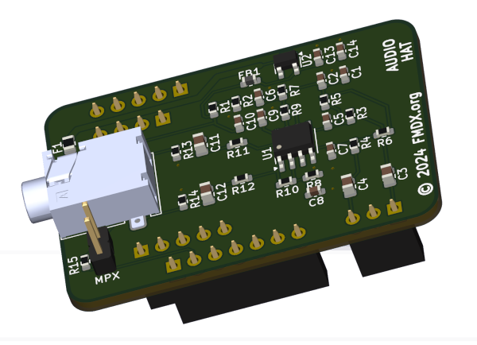

# Audiohat for Headless TEF

This is an add-on PCB for the Headless TEF, it will provide an extra analog audio output.

## Contributing
I'm open for a new ideas in our project. Feel free to share your thoughts in [Discussions](https://github.com/PE5PVB/Audiohat-Headless-TEF/discussions).\
You can also contribute to the project using [Pull Requests](https://github.com/PE5PVB/Audiohat-Headless-TEF/pulls). We will review it and merge into main branch.

You are using my hardware and you found a difficulty? Please create new [issue](https://github.com/PE5PVB/Audiohat-Headless-TEF/issues) and describe your problem.

I also would like to invite you to join our Discord community where we share our ideas and help each other with some issues.\
  

Special thanks to all [contributors](https://github.com/PE5PVB/Audiohat-Headless-TEF/graphs/contributors). You are awesome! ❤️

## If you like this hardware

